# **report.md — TP1 Modern Computer Vision**
NIAURONIS Tatiana – FIPA 3A  
CSC8608 – TP1

---

## **Exercice 1 — Initialisation du dépôt, réservation GPU, et lancement de la UI via SSH**

### **Question 1.c**

### Repo
Lien du dépôt : https://github.com/tatiana-nrs/CSC8608

### Environnement d’exécution
Exécution sur nœud GPU via SLURM

### Arborescence

On a cette arborescence:

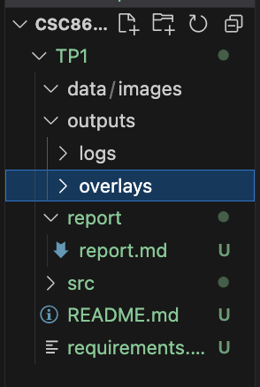

### **Question 1.e**

Le TP est exécuté en local.

### **Question 1.g**

On peut voir que l’import de segment_anything fonctionne:

```
ok
sam_ok
```

### **Question 1.i**


---

## **Exercice 2 — Constituer un mini-dataset (jusqu’à 20 images)**

### **Question 2.b**

On a 10 images téléchargées comme on peut le voir ici:

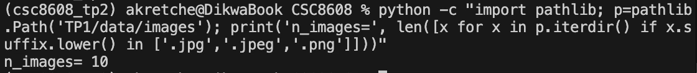

### Images représentatives

- simple_flower_white_green_bg.jpg
Objet unique avec un fort contraste (fleur blanche sur fond vert), idéal pour observer une segmentation précise.

- simple_animal_fox_portrait.jpg
Sujet principal (renard) bien détaché du fond avec des contours nets, permettant de vérifier la cohérence du masque sur un objet de grande taille.

- crowded_home_office_wall_decor.jpg
Scène chargée contenant de nombreux objets visuels, intéressante pour analyser les ambiguïtés de segmentation.

- difficult_glass_transparency.jpg
Verre transparent avec reflets, peu de contraste.

- difficult_water_fish_reflections.jpg
Scène difficile combinant reflets, texture de l’eau et requin peu visible


Un exemple de cas simple serait la plante:


Un cas difficile serait le requin avec les reflets de l'eau:

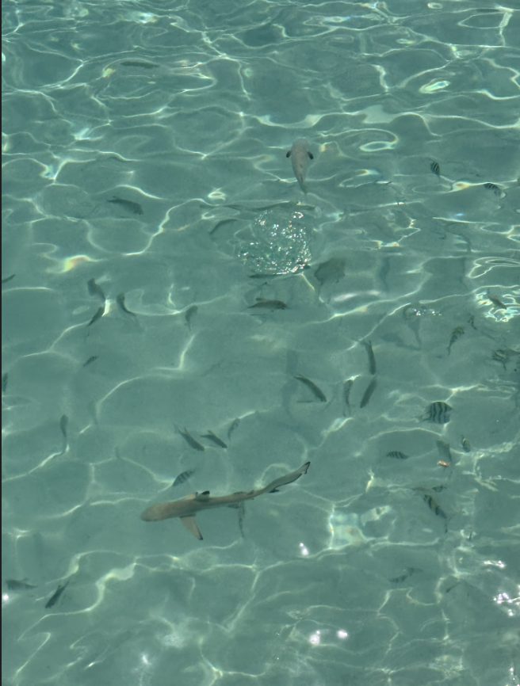

---

## **Exercice 3 — Charger SAM (GPU) et préparer une inférence “bounding box → masque”**

### **Question 3.a**

Le fichier est bien présent:

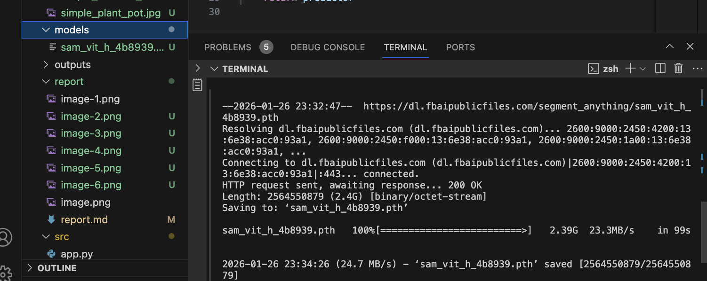

### **Question 3.e**

On obtient:

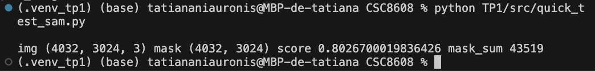

Le modèle utilisé est Segment Anything – ViT-H (vit_h), avec le checkpoint suivant sam_vit_h_4b8939.pt

L’inférence fonctionne correctement et produit un masque cohérent de taille (H, W). Cette sortie montre que le masque généré a la même résolution que l’image d’entrée et qu’un score de confiance de 0.80 est correctement associé à la prédiction.
Sur des images de grande résolution (4032×3024), le temps d’exécution est assez long.

Les premières limites observées concernent la sensibilité au placement de la bounding box et les performances réduites sur des objets peu contrastés ou transparents.

---

## **Exercice 4 — Mesures et visualisation : overlay + métriques (aire, bbox, périmètre)**

### **Question 4.d**

Un overlay a été généré à partir de l’image simple_flower_white_green_bg.jpg:

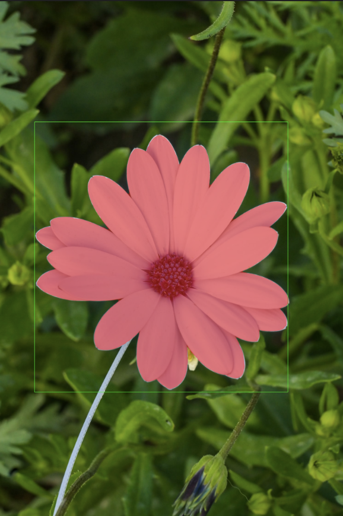


Un tableau récapitulatif serait:

| Image                                   | Score SAM | Aire (px) | Périmètre (px) |
|----------------------------------------|-----------|-----------|----------------|
| simple_flower_white_green_bg.jpg        | 1.0056    | 2 917 921 | 11 762.82      |
| crowded_kitchen_preparation.jpg         | 0.9544    | 38 201    | 3 404.08       |
| difficult_glass_transparency.jpg        | 1.0069    | 71 166    | 1 058.39       |


L’overlay est un outil pour comprendre et diagnostiquer le comportement du modèle de segmentation. Il permet de vérifier visuellement si la bounding box fournie correspond bien à l’objet d’intérêt et si le masque généré correspond aux contours. Dans les cas simples (objet centré, bien contrasté), l’overlay confirme rapidement que la segmentation est cohérente. En revanche, sur des scènes complexes comme la cuisine, l’overlay met en évidence des erreurs de sur-segmentation ou de débordement du masque. Il aide ainsi à ajuster la bounding box, à comparer plusieurs prompts et à identifier les limites du modèle.

---

## **Exercice 5 — Mini-UI Streamlit : sélection d’image, saisie de bbox, segmentation, affichage et sauvegarde**

### **Question 5.d**

Pour le cas simple on a :

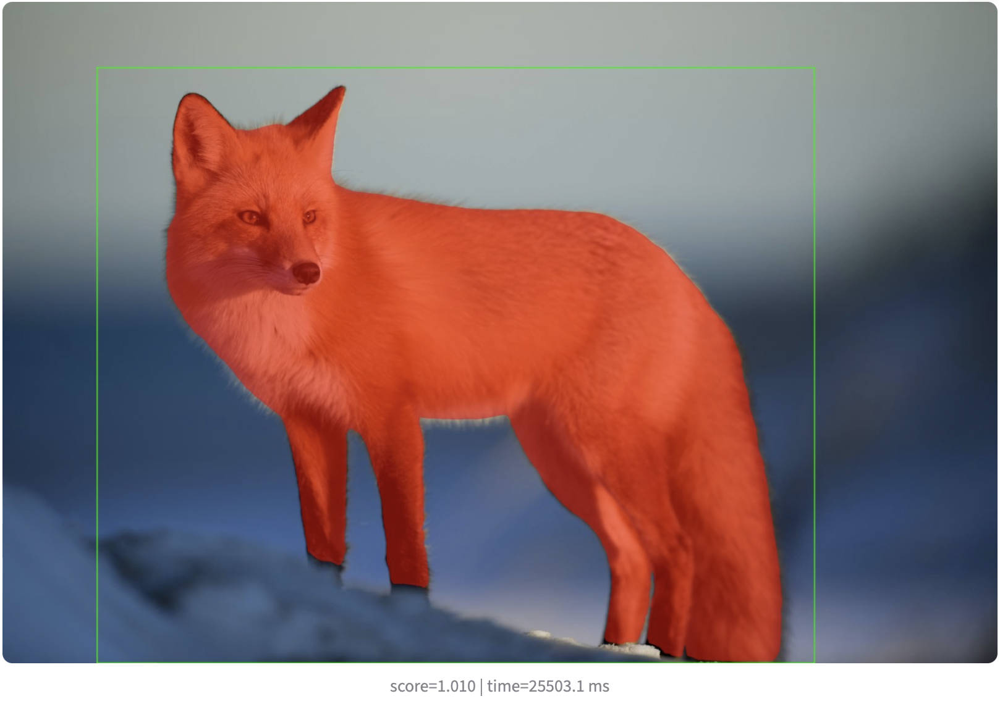

Et pour le cas difficile, nous obtenons:

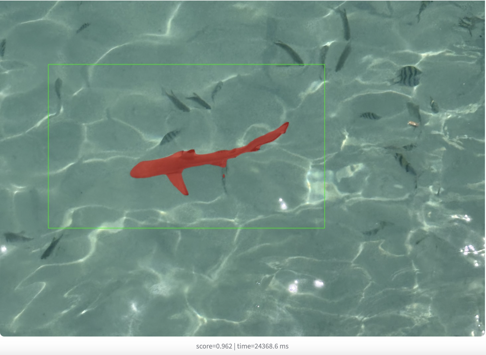

Voici un tableau récapitulatif:

| Image                              | BBox (x1, y1, x2, y2)         | Score | Aire (px) | Temps (ms) |
|-----------------------------------|-------------------------------|-------|-----------|------------|
| simple_animal_fox_portrait.jpg  | [285, 198, 2248, 1996]       | 0.989 | 45554     | 25542      |
| difficult_water_fish_reflections.jpg | [811, 2694, 1801, 3151]        | 0.962 | 90007     | 24369      |
| crowded_borough_market.jpg        | [192, 77, 507, 324]           | 0.730 | 18439     | 23344      |


L’overlay est particulièrement utile pour debugger l’influence de la bounding box sur la segmentation. Lorsque la bbox est trop petite, le modèle manque de contexte visuel et le masque est souvent incomplet ou tronqué surtout sur des objets fins ou allongés (comme les poissons). À l’inverse, une bbox trop large introduit du bruit et le modèle segmente parfois des régions du fond ou plusieurs objets simultanément, ce qui dégrade la précision du masque (comme avec la rue).

On observe que la meilleure segmentation est avec une bbox légèrement plus grande que l’objet incluant un peu de contexte sans englober toute la scène. L’overlay permet de voir immédiatement ces effets et d’ajuster la bbox.

---

## **Exercice 6 — Affiner la sélection de l'objet : points FG/BG + choix du masque (multimask)**

### **Question 6.g**

**IMAGE 1**

On obtient, avec bbox seule sans points:

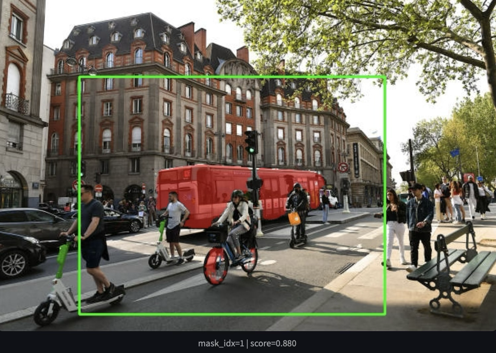

L'objet que je voulais segmenter est la dame en vélo au centre. Même en changeant le masque, aucun n'isole le vélo.

Avec un point FG au centre de la dame, on obtient:

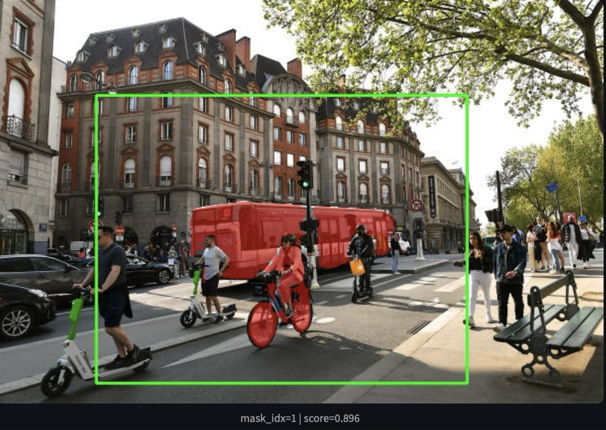

Les coordonnées du point FG sont: 


Ici, on a une amélioration car le masque se rapproche du vélo mais reste trop large et inclut encore le bus. Le meilleur masque est le 1.

On tente en mettant un point BG sur le bus qui est très dominant:

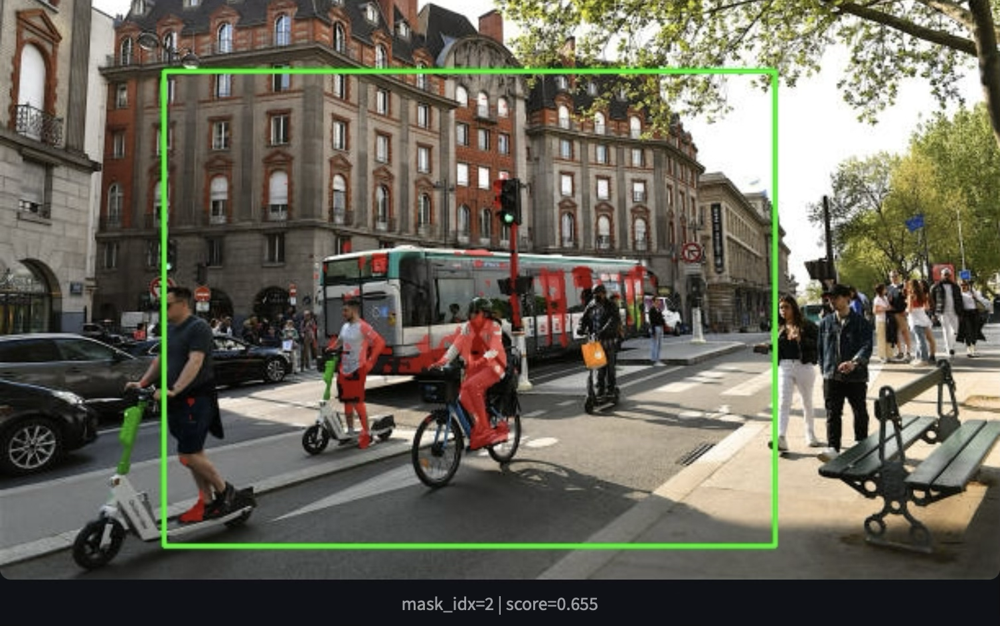

On avait ces coordonnées:

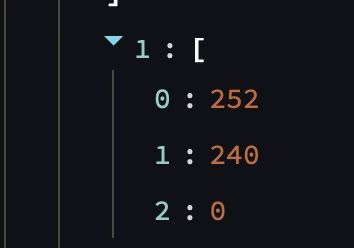

Le multimask qui isole le mieux le vélo est le multimask 2.

**IMAGE 2**

Avec bbox seule sans points, on a:

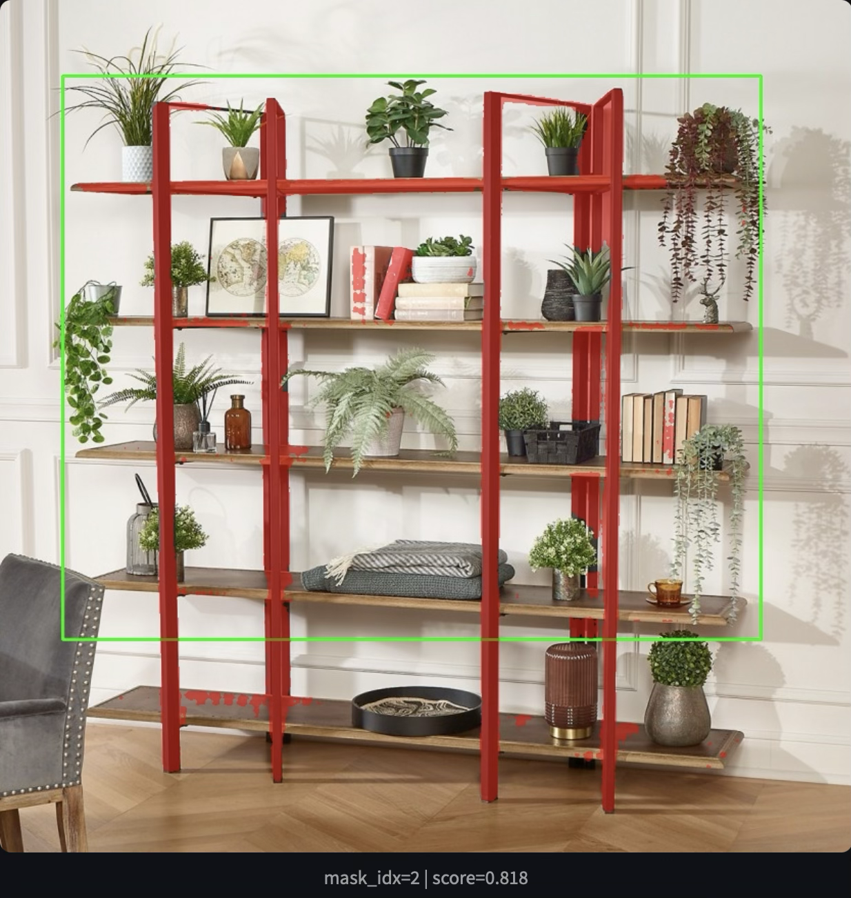

L'objet que je voulais segmenter était la plante centrale. Ici, on voit que seule l'étagère est inclue.

En ajoutant un point FG, on a:

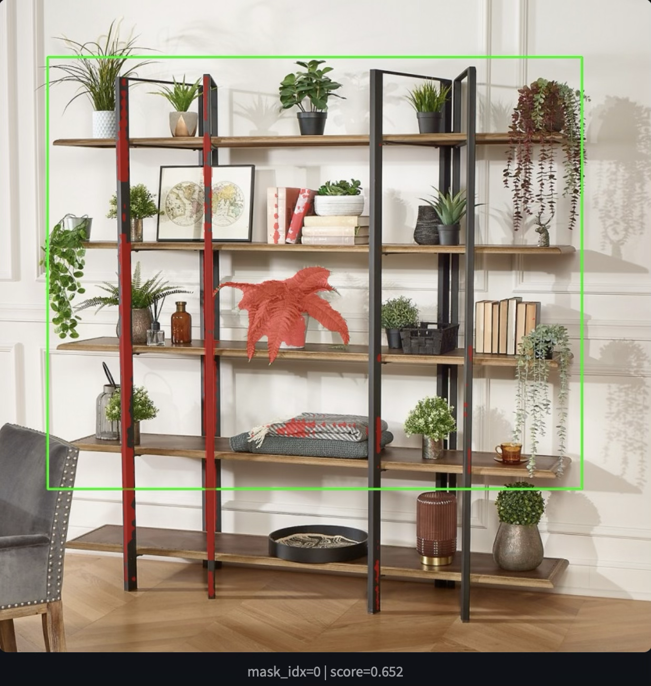

Les coordonnées du point sont:

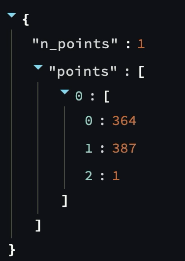

Ici, on voit que la plante est entièrement englobée mais l'étagère l'est aussi.

En rajoutant un point BG, on obtient:

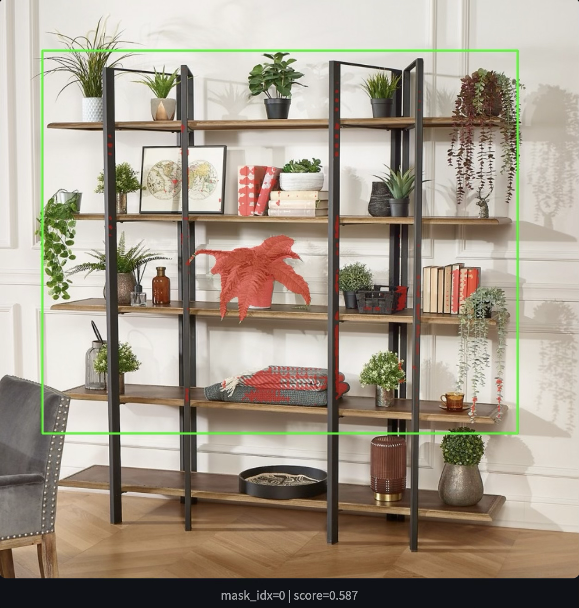

Les coordonnées de ce deuxième point sont:

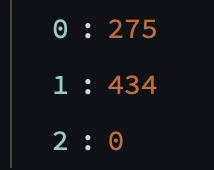

Le meilleur masque était le masque 0 de nouveau. On voit que la plante est bien segmentée.

Les points BG deviennent indispensables lorsque la bbox contient plusieurs objets visuellement similaires ou spatialement proches comme l'étagère. Dans nos tests, un point FG seul ne suffisait pas à isoler l’objet voulu dans des scènes denses comme la rue avec piétons, vélos ou comme l'étagère avec les plantes similaires. Le point BG permet d’exclure explicitement les zones ambiguës que le modèle a tendance à inclure. En revanche, certains cas restent difficiles malgré FG et BG comme les objets très fins ou fortement entremêlés avec le fond.

---

## **Exercice 7 — Bilan et réflexion (POC vers produit) + remise finale**

### **Question 7.a**

Trois facteurs principaux expliquent les échecs de segmentation observés. Premièrement, les fonds complexes ou très chargés (phto de la rue) introduisent des ambiguïtés fortes entre l’objet et son environnement. Deuxièmement, la présence d’objets visuellement similaires dans une même bbox (plantes, personnes, vélos) entraîne des confusions. Troisièmement, les objets fins ou partiellement occultés sont mal segmentés par défaut. Pour améliorer la situation, plusieurs actions sont possibles comme enrichir l’UI avec des points BG explicites, contraindre davantage la bbox (taille minimale, recentrage).

### **Question 7.b**

Pour industrialiser cette brique, je monitorerais : (1) le score des masques sélectionnés, (2) l’aire du masque par rapport à la bbox, (3) le nombre de points FG/BG utilisés par l’utilisateur, (4) la latence totale de segmentation, et (5) le taux de changement de masque après interaction utilisateur (multimask). Ces signaux permettent d’identifier un drift visuel, une baisse de qualité perçue ou une dégradation des performances.


