# **report.md — TP2 Génération d'image**
NIAURONIS Tatiana – FIPA 3A  
CSC8608 – TP2

---

## **Exercice 1 — Mise en place & smoke test (GPU + Diffusers)**

### **Question 1.c**

Le smoke test s'est exécuté correctement et l'image a été générée :

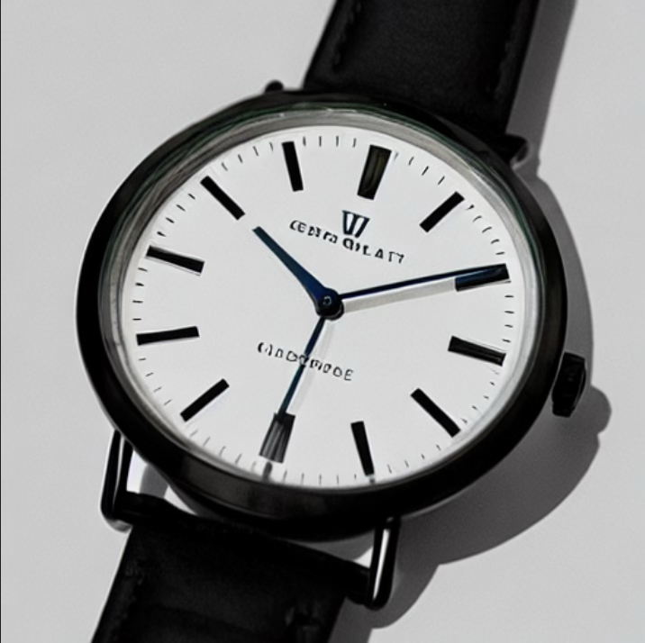

---

## **Exercice 2 — Factoriser le chargement du pipeline (text2img/img2img) et exposer les paramètres**

### **Question 2.b**

On obtient:

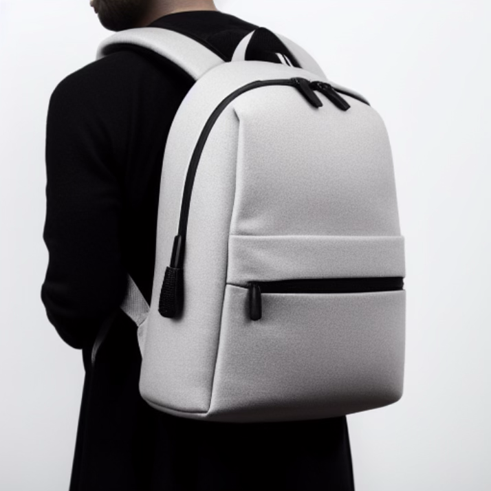

La configuration utilisée est:

- model_id : stable-diffusion-v1-5/stable-diffusion-v1-5
- scheduler : EulerA
- seed : 42
- num_inference_steps : 30
- guidance_scale : 7.5

---

## **Exercice 3 — Text2Img : 6 expériences contrôlées (paramètres steps, guidance, scheduler)**

### **Question 3.c**

On obtient:

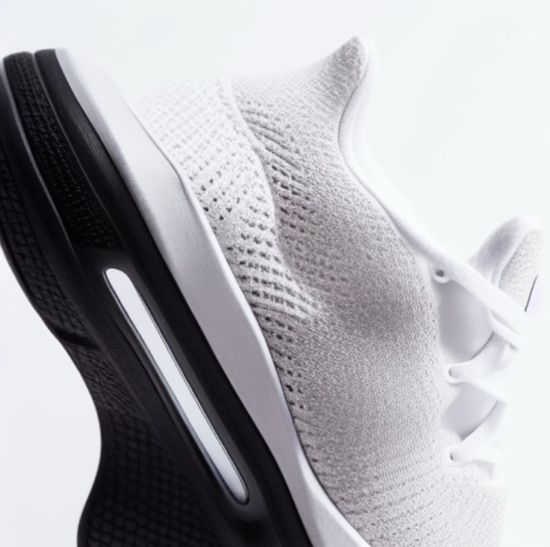
outputs/t2i_run01_baseline.png

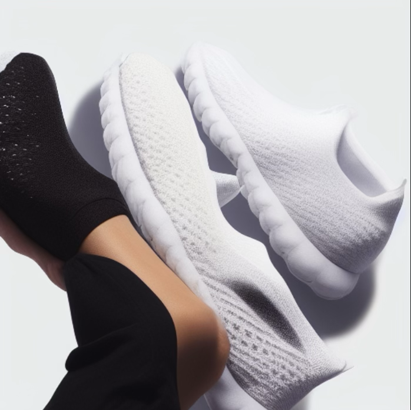
outputs/t2i_run02_steps15.png

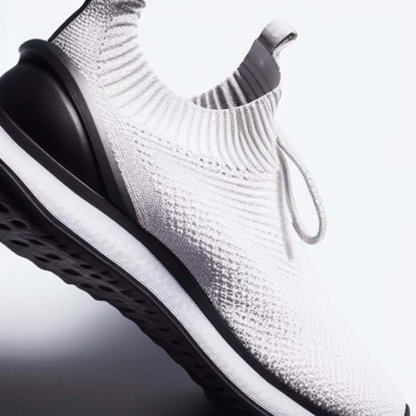
outputs/t2i_run03_steps50.png

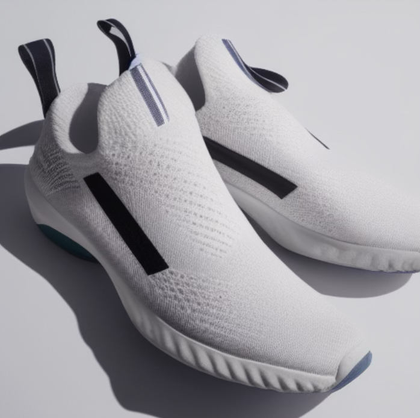
outputs/t2i_run04_guid4.png

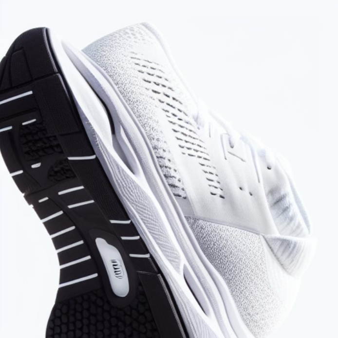
outputs/t2i_run05_guid12.png

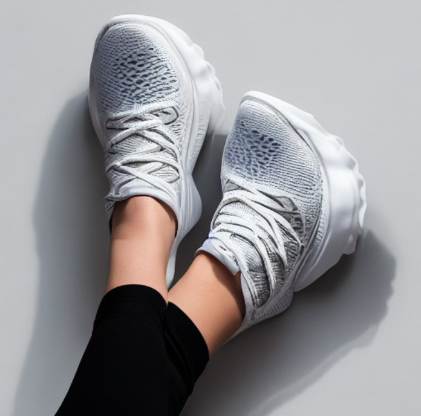
outputs/t2i_run06_ddim.png

- **Effet des steps (15 → 30 → 50)** :
  - À **15 steps**, l’image tend à être moins “finie” : détails de texture et bords moins propres (une chaussure est déformée et la jambe aussi) et le rendu est assez brouillon. 
  - À **30 steps**, le rendu est globalement net et cohérent (même si un peu déformé), la texture textile est crédible et la lumière est bonne. La scéne est un gros plan.
  - À **50 steps**, les micro-détails (tissu et semelle) sont plus nets avec moins de bruit résiduel, ici c'est le plus réaliste. 

- **Effet de la guidance (4.0 → 7.5 → 12.0)** :
  - À **guidance=4.0**, le modèle s’autorise plus de liberté donc on a une composition plus variée qui reste fidèle au prompt, la paire de chaussure est visible et le rendu fait "catalogue".
  - À **guidance=7.5**, on a une bonne fidélité au prompt (style studio e-commerce, fond clair, chaussure au centre) même si c'est un peu déformé car c'est un gros plan d'une chaussure est pas une paire.
  - À **guidance=12.0**, les contrastes et texture sont très accentués jusqu'à rendre l'ensemble moins réaliste (déformation, incohérence cadrage étrange)

- **Effet du scheduler (EulerA vs DDIM)** :
  - À seed identique, EulerA produit une image plus contrastée mais l'image reste un gros plan.
  - DDIM rend le scéne différente, les chaussures sont portées avec les jambes visibles (déformées).

---

## **Exercice 4 — Img2Img : 3 expériences contrôlées (strength faible/moyen/élevé)**

### **Question 4.c**

L'image source utilisée est:

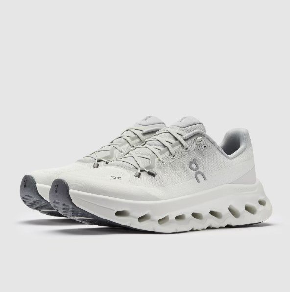

Pour strength = 0.35:

**Ce qui est conservé :**

- La forme globale de la chaussure est très proche de l’image source.

- L’identité du produit (type de chaussure, proportions, silhouette) est clairement reconnaissable.

- Le cadrage et le point de vue restent cohérents avec l’image d’origine.

**Ce qui change :**

- Les textures sont légèrement lissées et homogénéisées.

- Quelques détails fins (semelle) sont subtilement stylisés.

**Utilisabilité e-commerce :**

- Très bonne. Le produit reste fidèle à l’original avec une amélioration visuelle légère. 

Avec strength = 0.60:

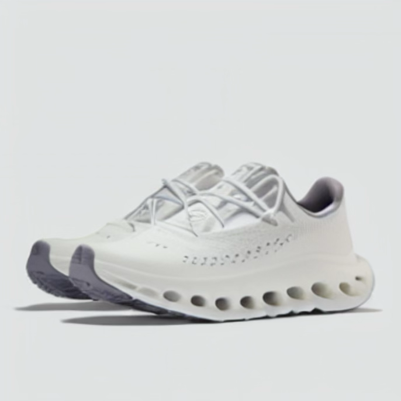

**Ce qui est conservé :**

- Le produit reste globalement reconnaissable comme une chaussure de sport et le fond clair et le style studio sont maintenus.

**Ce qui change :**

- La géométrie de la semelle et des languettes change.

- Les textures deviennent plus stylisées et moins fidèles à l’image source.

- Certains détails comme les lacets commencent à diverger.

**Utilisabilité e-commerce :**

Acceptable

Avec strength = 0.85:

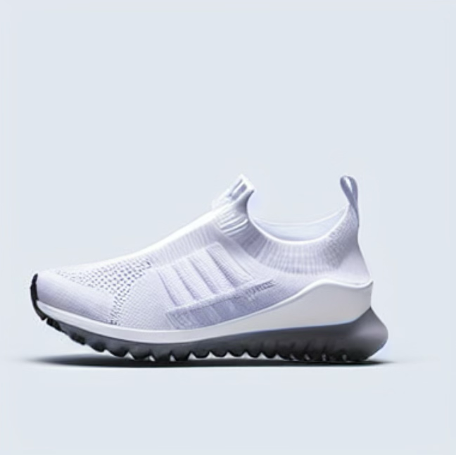

**Ce qui est conservé :**

- La catégorie générale du produit qui rreste une chaussure de sport et on utilise la même palette de couleurs.

**Ce qui change :**

- La structure globale du produit est fortement modifiée.

- La semelle et les proportions sont totalement changées.

- L’image s’éloigne fortement de la référence initiale, avec un rendu proche du text-to-image.

**Utilisabilité e-commerce :**

- Faible. Le produit généré ne correspond plus fidèlement à l’image source. Niveau trop élevé pour un usage catalogue.

---

## **Exercice 5 — Mini-produit Streamlit (MVP) : Text2Img + Img2Img avec paramètres**

### **Question 5.c**

**En Text2Img**:

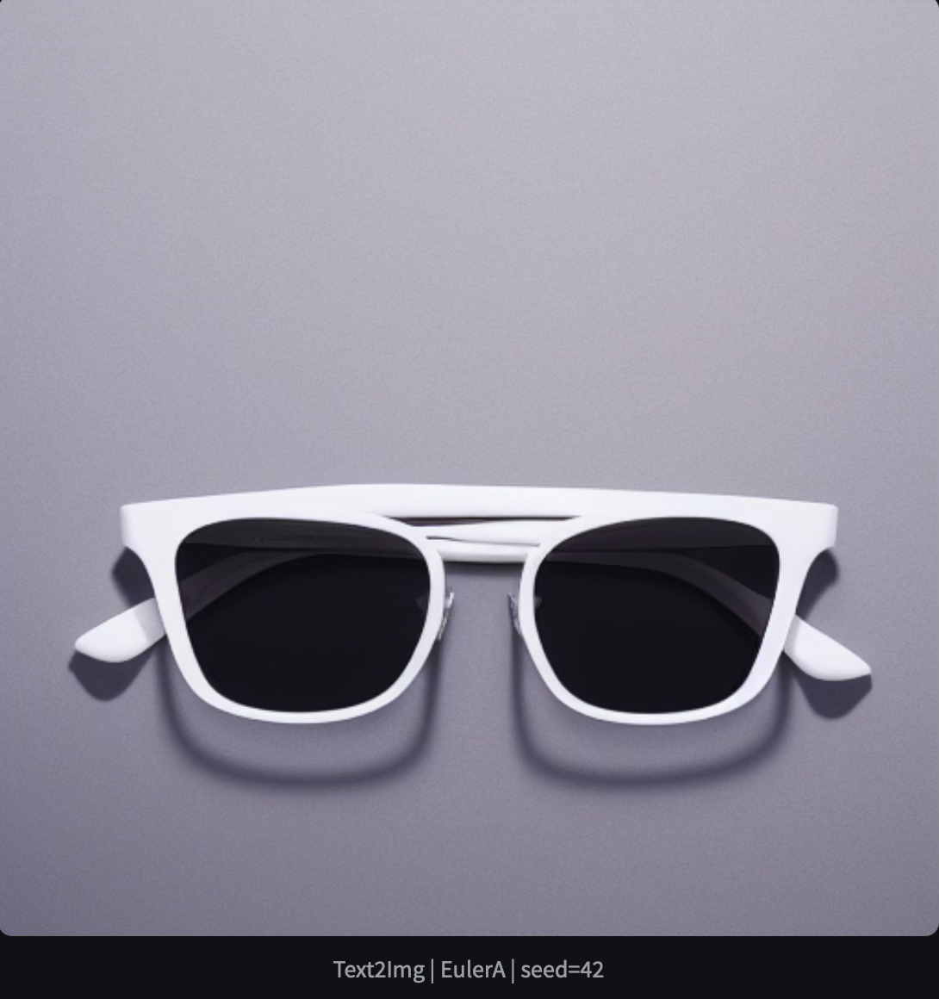

La config correspondante est:

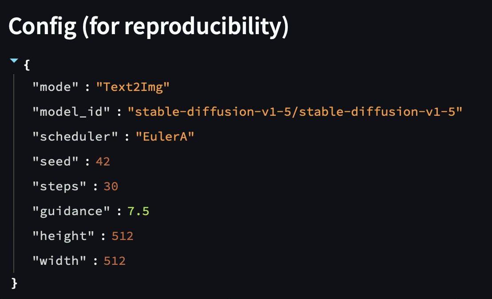

**En img2Img, on a**:

Avec pour config:

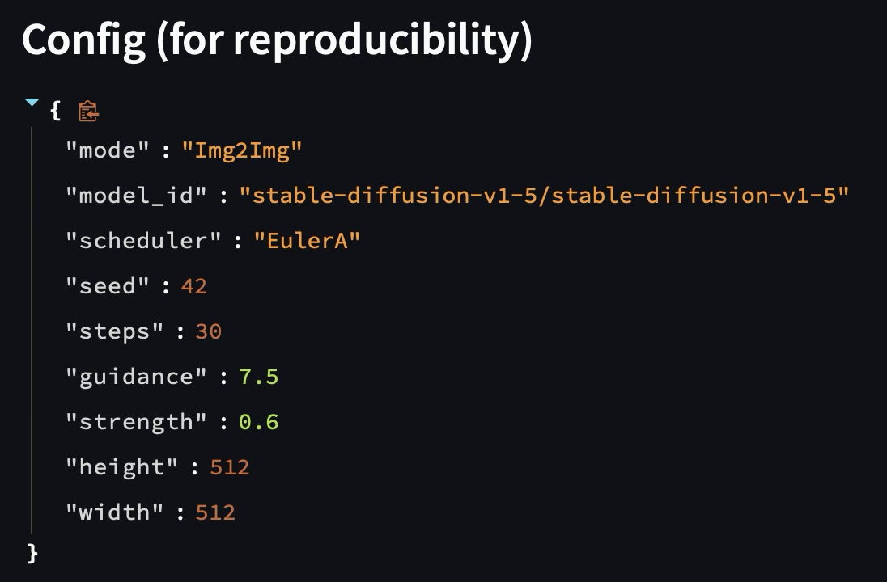

---

## **Exercice 6 — Évaluation (léger) + réflexion (à finir à la maison)**

### **Question 6.a/b**

**Images évaluées**

- Text2Img – baseline : lunettes, EulerA, seed=42, steps=30, guidance=7.5

- Text2Img – paramètre extrême : lunettes, EulerA, seed=42, steps=30, guidance=15

- Img2Img – strength élevé : lunettes, EulerA, seed=42, steps=30, guidance=7.5, strength=0.85

| Image | Prompt adherence (0–2) | Visual realism (0–2) | Artifacts (0–2) | E-commerce usability (0–2) | Reproducibility (0–2) | Total /10 |
|------|------------------------|----------------------|------------------|-----------------------------|-----------------------|-----------|
| Baseline: 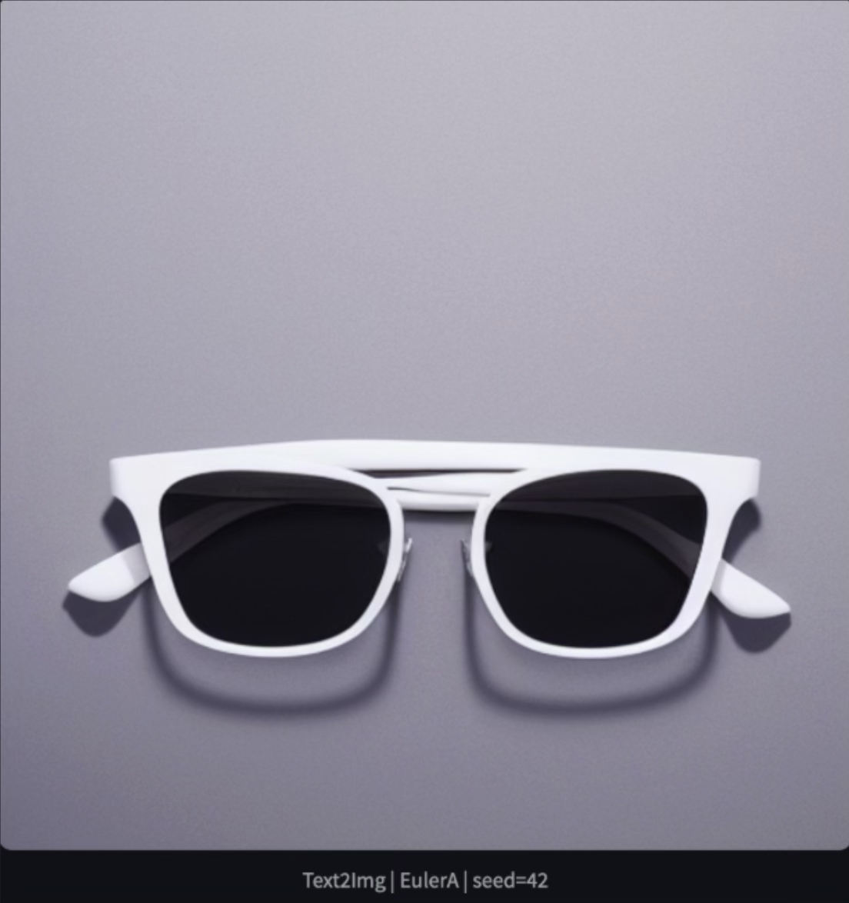| 2 | 1 | 1 | 2 | 2 | **8/10** |
| Guidance 15: 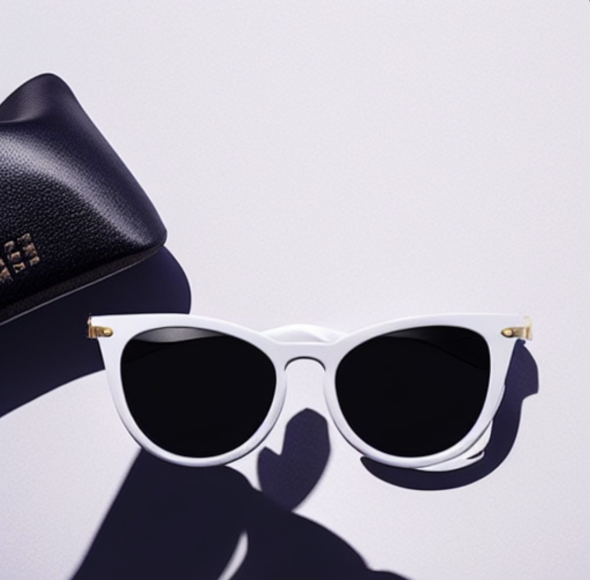 | 2 | 2 | 1 | 2 | 2 | **9/10** |
| Strenght 0,85: 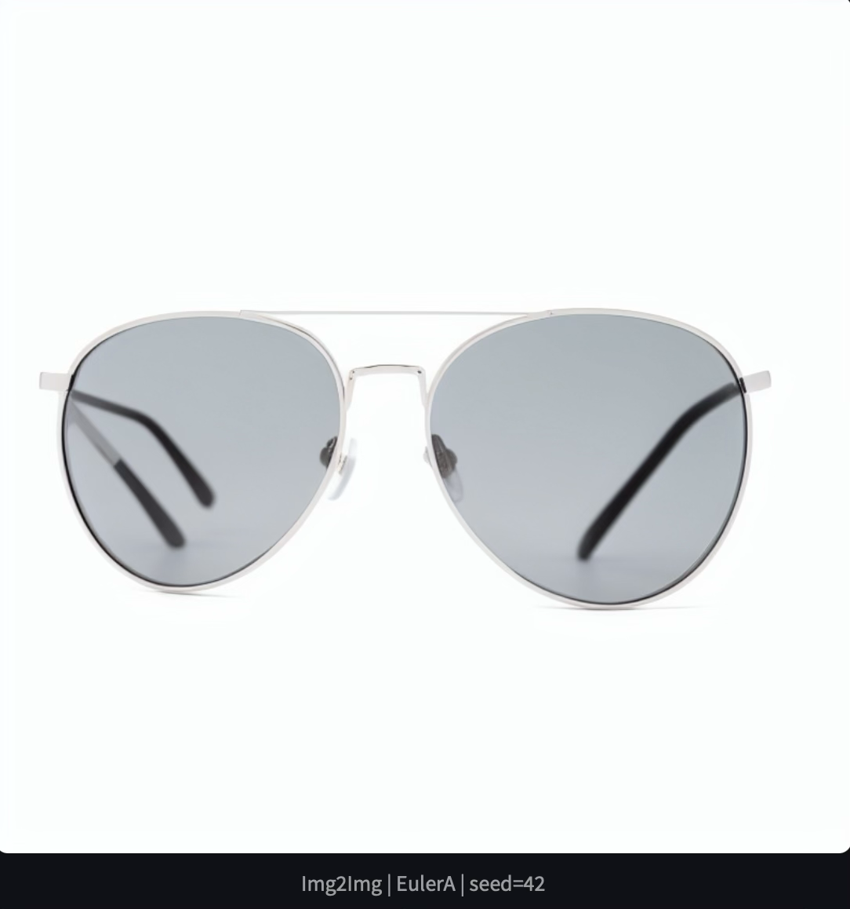 | 1 | 1 | 1 | 0 | 2 | **5/10** |

- Text2Img – baseline

Très bonne correspondance au prompt : lunettes minimalistes, fond blanc, éclairage studio. Le rendu est réaliste (sauf devant) des matériaux (verres, monture) et ombres propres.

Image directement exploitable en e-commerce après retouches mineures (contraste/couleur).

- Text2Img – guidance élevé (15)

Prompt toujours respecté avec l'apparition d’ombres plus dures et de légères incohérences sur la symétrie.

- Img2Img – strength = 0.85

La forme globale des lunettes est partiellement conservée et on a trois branches au lieu de deux. Le risque e-commerce est élevé, l'image est trompeuse.

### **Question 6.c**

Ce TP met en évidence le compromis entre qualité visuelle et coût/latence. Augmenter le nombre de steps ou la guidance améliore parfois la netteté, mais augmente le temps de génération et peut dégrader le réalisme, comme observé avec guidance=15. 

La reproductibilité repose sur un ensemble minimal de paramètres : seed, scheduler, 
steps, guidance et strength en img2img. Une modification de l’un d’eux peut produire 
une image très différente. En contexte e-commerce, les principaux risques sont les 
hallucinations visuelles (comme les lunettes à trois branches), la dérive du produit réel et l’apparition de détails trompeurs (logos, formes modifiées comme pour les jambes avec les chuassures).  Pour limiter ces risques, je mettrais en place des seuils de strength, des prompts contraignants, une validation humaine systématique.

