# **report.md — TP3 Deep learning pour audio**
NIAURONIS Tatiana – FIPA 3A  
CSC8608 – TP3

---

## **Exercice 1 — Initialisation du TP3 et vérification de l’environnement**

### **Question 1.c**

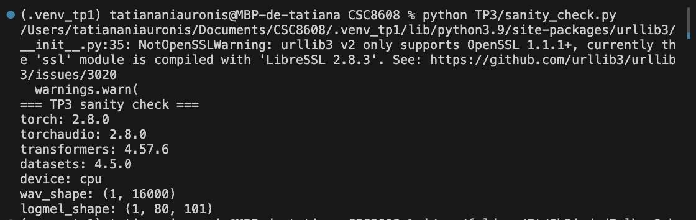

Le sanity check confirme que l’environnement fonctionne correctement (Torch, Torchaudio, Transformers installés) que le device détecté est le CPU (car TP fait localement) et que la génération du signal audio et du log-mel spectrogram produit des dimensions cohérentes.

---

## **Exercice 2 — Constituer un mini-jeu de données : enregistrement d’un “appel” (anglais) + vérification audio**

### **Question 2.b/c**

On obtient: 

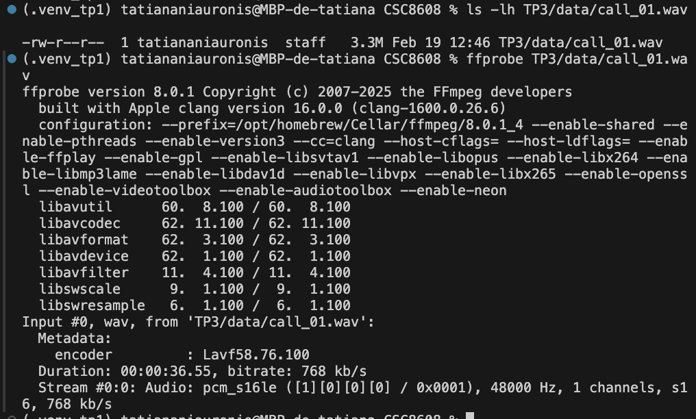

Ici, on peut voir que l'audio est en 48 kHz mono donc je convertis l'audio:

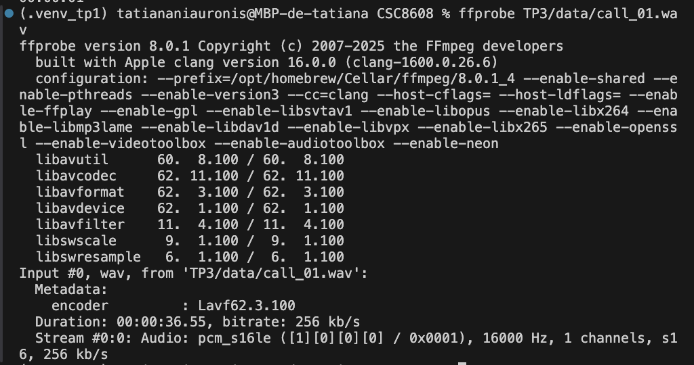

L'audio est bien conforme car il est en WAV mono 16 kHz.

### **Question 2.d/e**

On obtient:

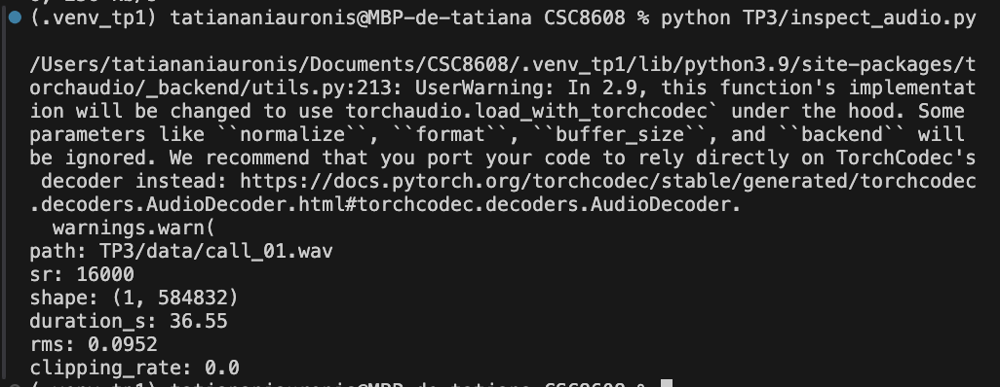

Le fichier audio est en 16 kHz mono, d’une durée de 36,55 secondes, avec un niveau RMS correct et aucun clipping donc il est adapté au traitement de la parole.

---

## **Exercice 3 — VAD (Voice Activity Detection) : segmenter la parole et mesurer speech/silence**

### **Question 3.b/c**

A l'exécution, on obtient:

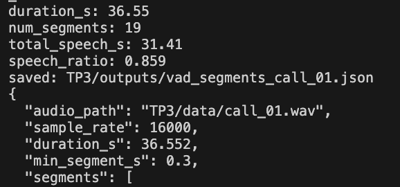

Voici un extrait:

```
"segments": [
    {
      "start_s": 0.578,
      "end_s": 6.494
    },
    {
      "start_s": 6.85,
      "end_s": 9.918
    },
    {
      "start_s": 10.018,
      "end_s": 12.414
    },
    {
      "start_s": 12.514,
      "end_s": 13.95
    },
    {
      "start_s": 14.306,
      "end_s": 15.646
    },
```

Le ratio speech/silence est cohérent avec ma lecture car j’ai parlé de manière assez continue avec peu de pauses longues. On observe des segments très courts (1 seconde) ce qui indique que le VAD est assez sensible aux respirations ou aux très courtes pauses. À l’inverse, certains segments sont très longs (ex segment 0) et regroupent plusieurs phrases.

### **Question 3.d**

En passant de 0.30 à 0.60, le nombre de segments diminue (19 à 15) et le speech_ratio baisse légèrement ( 0,86 à 0,80). Le filtrage supprime plusieurs passages très courts d’environ 1 seconde liés aux respirations ou petites pauses.

---

## **Exercice 4 — ASR avec Whisper : transcription segmentée + mesure de latence**

### **Question 4.b**

On obtient:

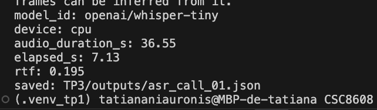

On peut voir que l'audio est transcrit en 7,13 secondes ce qui est rapide.

On a:

```
"segments": [
    {
      "segment_id": 0,
      "start_s": 0.578,
      "end_s": 6.494,
      "text": "Hello, thank you for calling customer support. My name is Alex and I will help you today."
    },
    {
      "segment_id": 1,
      "start_s": 6.85,
      "end_s": 9.918,
      "text": "I'm calling about an order that arrived the maged."
    },
    {
      "segment_id": 2,
      "start_s": 10.018,
      "end_s": 12.414,
      "text": "The package was delivered yesterday."
    },
    {
      "segment_id": 3,
      "start_s": 12.514,
      "end_s": 13.95,
      "text": "But the screen is cracked."
    },
    {
      "segment_id": 4,
      "start_s": 14.306,
      "end_s": 15.646,
      "text": "I would like your refund."
    },
```

et:

```
"full_text": "Hello, thank you for calling customer support. My name is Alex and I will help you today. I'm calling about an order that arrived the maged. The package was delivered yesterday. But the screen is cracked. I would like your refund. or replacement as soon as possible. The Rd number is A. 9th. Seven. You can reach me at john.smissatexample.com Also, my fun number is... Five, five, five. 0-1. 9-9 Thank you."
```

La segmentation VAD aide globalement la transcription car elle évite que Whisper traite les silences ce qui améliore la lisibilité du texte. Mais certains segments trop courts provoquent des coupures de mots ou d’informations. Par exemple, les segment_id 6, 7 et 8 découpent le numéro de commande en plusieurs morceaux. On observe aussi des erreurs sur des mots isolés (“the maged” et “fun number”) liées au manque de contexte. À l’inverse, les segments plus longs (segment_id 0) produisent une transcription plus fluide. 

---

## **Exercice 5 — Call center analytics : redaction PII + intention + fiche appel**

### **Question 5.b**

On a obtenu:

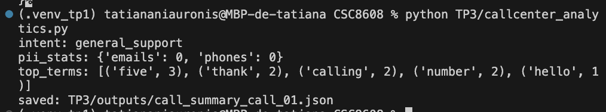

L’intention détectée est general_support et aucune PII n’est masquée (emails=0, phones=0) car l’ASR ne produit pas les formats standards (@ absent dans l’email, chiffres fragmentés), ce qui fait échouer les regex simples.

Voici un extrait:

```
  "pii_stats": {
    "emails": 0,
    "phones": 0
  },
  "intent_scores": {
    "refund_or_replacement": 3,
    "delivery_issue": 5,
    "general_support": 6
  },
  "intent": "general_support",
  "top_terms": [
    [
      "five",
      3
    ],
    [
      "thank",
      2
    ],
    [
      "calling",
      2
    ],
    [
      "number",
      2
    ],
    [
      "hello",
      1
    ],
```

### **Question 5.e**

Avec le post-tratitement, on a:

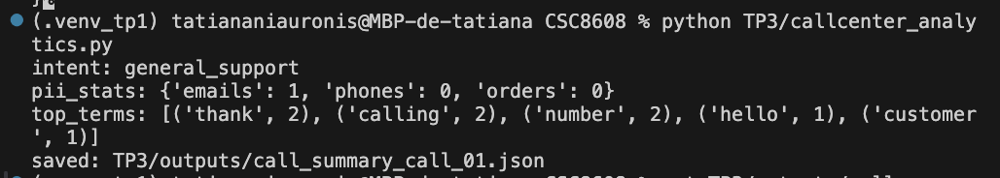

Avant post-traitement, aucune PII n’était détectée (emails=0, phones=0). Après ajout du post-traitement, l’email est correctement masqué (emails=1) mais le téléphone et l’order id ne sont pas détectés (phones=0, orders=0). 

Le téléphone apparaît maintenant sous forme 5550199 (bien recollé) donc la regex téléphone devrait marcher en théorie, mais ici il est collé à thank you dans la même phrase.

L’order id n’est pas détecté car la phrase ASR est “The Rd number is …” au lieu de “order number is” donc la règle redact_order_id ne se déclenche pas.

### **Question 5.f**

Les erreurs de transcription Whisper qui impactent le plus les analytics sont celles qui déforment les mots-clés et les PII. Par exemple, “damaged” est transcrit “the maged”, ce qui peut diminuer le score refund_or_replacement si on s’appuie sur des mots exacts. Pour les PII, l’email était d’abord transcrit sans format standard (pas de @) ce qui empêchait toute détection et après post-traitement, il est correctement masqué. Mais l’identifiant de commande n’est pas détecté car “order number” devient “Rd number”. De même le numéro de téléphone est collé à thank you.

---

## **Exercice 6 — TTS léger : générer une réponse “agent” et contrôler latence/qualité**

### **Question 6.b**

A l'exécution, on a:

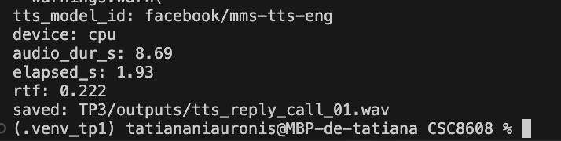

### **Question 6.c**

On vérifie les métadonnées du WAV:

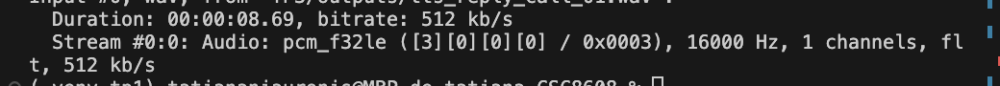

### **Question 6.d**

La prononciation est correcte même si le rythme est monotone et la voix robotique. Aucune coupure n’a été observé. Avec un RTF ≈ 0.22, la génération est un peu plus rapide que le temps réel.

### **Question 6.e**

On obtient: 

```
text: Thanks for calling. I am sorry your order arrived. Demaged I can offer a replacement or a refund. Please confirm your preferred option.
```

---

## **Exercice 7 — Intégration : pipeline end-to-end + rapport d’ingénierie (léger)**

### **Question 7.b**

On a eu:

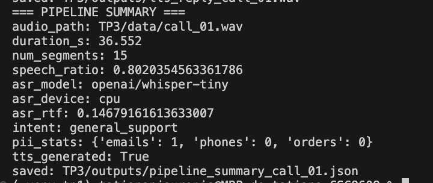


### **Question 7.c**

Voici le fichier:

```
{
  "audio_path": "TP3/data/call_01.wav",
  "duration_s": 36.552,
  "num_segments": 15,
  "speech_ratio": 0.8020354563361786,
  "asr_model": "openai/whisper-tiny",
  "asr_device": "cpu",
  "asr_rtf": 0.14679161613633007,
  "intent": "general_support",
  "pii_stats": {
    "emails": 1,
    "phones": 0,
    "orders": 0
  },
  "tts_generated": true
}
```

### **Question 7.d**

Le principal goulet d’étranglement en temps est l’étape Whisper car elle réalise l’inférence sur l’ensemble des segments audio même si le RTF reste faible. La segmentation VAD et le post-traitement texte constituent l’étape la plus fragile en qualité : des segments trop courts ou des erreurs ASR (mots mal reconnus ou identifiants déformés) impactent directement l’intention détectée et la redaction PII. Par exemple, l’email est correctement masqué mais le téléphone et l’identifiant de commande ne sont pas détectés, montrant une sensibilité aux erreurs de transcription.
Pour industrialiser sans entraîner de modèle, je mettrais en place une calibration plus fine du VAD avec fusion des segments trop courts et contrôle de longueur minimale et maximale afin de stabiliser l’ASR et un post-traitement texte plus robuste (normalisation).