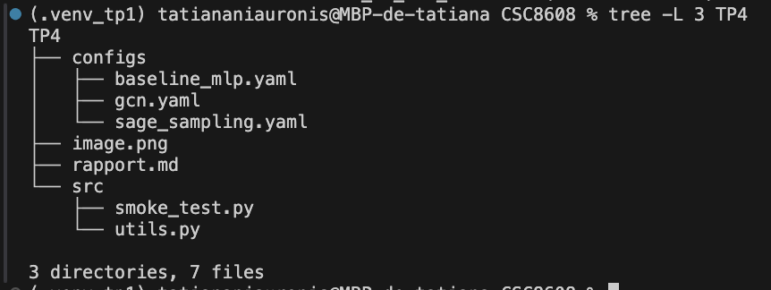
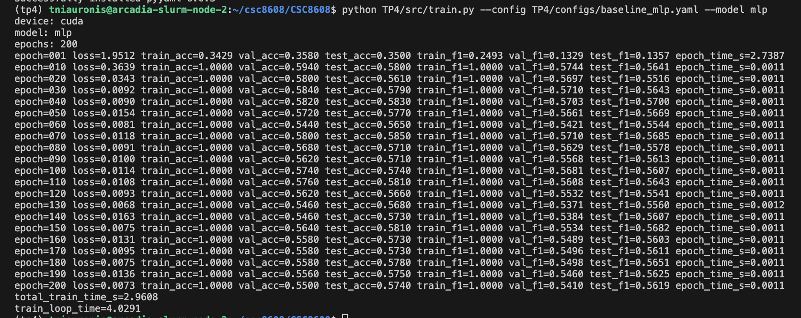
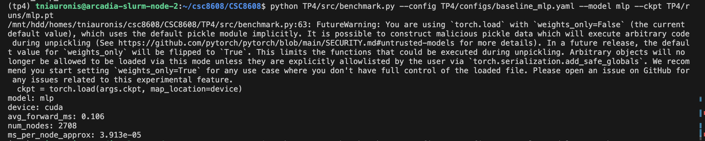
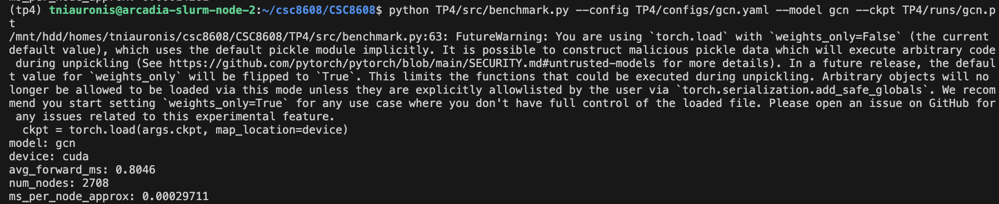
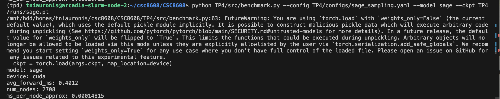

# **report.md — TP4 Graph Neural Networks**
NIAURONIS Tatiana – FIPA 3A  
CSC8608 – TP4

---

## **Exercice 1 — Initialisation du TP et smoke test PyG (Cora)**

### **Question 1.a**

On a bien la structure minimale demandée:



### **Question 1.e**

On a:

```
=== Environment ===
torch: 2.5.1+cu121
cuda available: True
device: cpu

=== Dataset (Cora) ===
Downloading https://github.com/kimiyoung/planetoid/raw/master/data/ind.cora.x
Downloading https://github.com/kimiyoung/planetoid/raw/master/data/ind.cora.tx
Downloading https://github.com/kimiyoung/planetoid/raw/master/data/ind.cora.allx
Downloading https://github.com/kimiyoung/planetoid/raw/master/data/ind.cora.y
Downloading https://github.com/kimiyoung/planetoid/raw/master/data/ind.cora.ty
Downloading https://github.com/kimiyoung/planetoid/raw/master/data/ind.cora.ally
Downloading https://github.com/kimiyoung/planetoid/raw/master/data/ind.cora.graph
Downloading https://github.com/kimiyoung/planetoid/raw/master/data/ind.cora.test.index
Processing...
Done!
num_nodes: 2708
num_edges: 10556
num_node_features: 1433
num_classes: 7
train/val/test: 140 500 1000

OK: smoke test passed.
```

---

## **Exercice 2 — Baseline tabulaire : MLP (features seules) + entraînement et métriques**

### **Question 2.g**

On calcule les métriques séparément sur train_mask, val_mask et test_mask car ils représentent trois rôles différents. Le train_mask sert à vérifier que le modèle apprend réellement (et détecter sous/sur-apprentissage). Le val_mask sert à guider les choix (hyperparamètres, architecture, early stopping) sans tricher avec le test. Le test_mask est gardé intact jusqu’à la fin pour estimer la performance finale de manière non biaisée.

### **Question 2.h**

La configuration utilisée est:

```
seed: 42
device: "cuda"
epochs: 200
lr: 0.01
weight_decay: 5e-4

mlp:
  hidden_dim: 64
  dropout: 0.5
```

A l'exécution, on a:



C’est normal que train_acc=1.0000 très vite car le MLP overfit sur les nœuds train et la val et test restent entre 0.57–0.59.
    
---

## **Exercice 3 — Baseline GNN : GCN (full-batch) + comparaison perf/temps**

### **Question 3.e**

On obtient pour MLP:

```
epoch=200 loss=0.0073 train_acc=1.0000 val_acc=0.5500 test_acc=0.5740 train_f1=1.0000 val_f1=0.5410 test_f1=0.5619 epoch_time_s=0.0011
```

Et pour GCN:

```
epoch=200 loss=0.0092 train_acc=1.0000 val_acc=0.7580 test_acc=0.8080 train_f1=1.0000 val_f1=0.7475 test_f1=0.8021 epoch_time_s=0.0019
```

Voici un tableau de comparaison:

| Modèle                | test_acc | test_macro_f1 | total_train_time_s |
|-----------------------|----------|---------------|--------------------|
| MLP (features seules) | 0.5740   | 0.5619        | 0.5500             |
| GCN (full-batch)      | 0.8080   | 0.8021        | 1.2775             |

On peut voir un gain du graphe : +0.23 en accuracy et +0.23 en macro-F1 et le temps est aussi un peu plus long (convolutions graph).

### **Question 3.f**

Sur Cora, le GCN dépasse le MLP car il exploite le signal du graphe : chaque nœud agrège l’information de ses voisins (via edge_index) ce qui injecte une information relationnelle que le MLP n'a pas. Le dataset est typiquement homophile (articles reliés souvent de la même thématique) donc chaque noeud regarde ses voisins pour faire la prédictions et améliore la généralisation. Le MLP peut vite sur-apprendre sur les 140 nœuds d’entraînement mais il reste limité car il ne propage pas l’information entre nœuds il utilise les feautures des noeuds. Le GCN peut parfois ne pas gagner si les features seules sont déjà suffisantes.

---

## **Exercice 4 — Modèle principal : GraphSAGE + neighbor sampling (mini-batch)**

### **Question 4.e**

Les hyperparamètres de sampling sont:

```
sampling:
  batch_size: 256
  num_neighbors_l1: 10
  num_neighbors_l2: 10
```

Les dernières lignes à l'exécution sont:

```
epoch=200 loss=0.0044 train_acc=1.0000 val_acc=0.7700 test_acc=0.8020 train_f1=1.0000 val_f1=0.7577 test_f1=0.7950 epoch_time_s=0.0034
```

### **Question 4.f**

Le neighbor sampling consiste à échantillonner un nombre limité de voisins (fanout) à chaque couche plutôt que d’utiliser tout le graphe. Cela réduit le nombre de nœuds et d’arêtes traités à chaque itération ce qui diminue l’usage mémoire GPU et accélère l’entraînement. Grâce au batch_size et aux paramètres num_neighbors_l1, num_neighbors_l2, on contrôle directement le coût computationnel.

Mais on ne voit qu’un sous-ensemble des voisins à chaque itération donc le gradient est une approximation bruitée du gradient réel. Un fanout trop faible augmente la variance du gradient et peut nuire à la stabilité ou à la performance finale. Les nœuds hubs sont sensibles : ne pas échantillonner assez de voisins peut faire perdre une information importante. À l’inverse, un fanout plus élevé améliore la qualité de l’estimation mais augmente le coût CPU (sampling) et GPU (propagation). Le neighbor sampling est donc un compromis entre vitesse, mémoire et précision du modèle.

---

## **Exercice 5 — Benchmarks ingénieur : temps d’entraînement et latence d’inférence (CPU/GPU)**

### **Question 5.d**

Pour MLP, on a:



Pour GCN, on obtient:



Et enfin pour sage, on a:



| Modèle        | test_acc | test_f1 | total_train_time_s | avg_forward_ms |
|---------------|----------|---------|--------------------|----------------|
| MLP           | 0.5740   | 0.5619  | 0.5500             | 0.1060         |
| GCN           | 0.8080   | 0.8021  | 1.2775             | 0.8046         |
| GraphSAGE     | 0.8020   | 0.7950  | 1.0100             | 0.4012         |

### **Question 5.e**

On effectue un warmup car les premières passes sur GPU sont souvent plus lentes. Ces coûts ne représentent pas la performance en régime stable. Sans warmup, la latence mesurée serait artificiellement élevée et peu représentative de l’inférence réelle.

Par ailleurs, l’exécution sur GPU est asynchrone : le CPU lance les kernels CUDA et continue immédiatement sans attendre la fin des calculs. Si on mesure le temps sans synchronisation, on capture seulement le temps de lancement des kernels, pas le temps effectif d’exécution.

---

## **Exercice 6 — Synthèse finale : comparaison, compromis, et recommandations ingénieur**

### **Question 6.a/b**

On a:

| Modèle     | test_acc | test_macro_f1 | total_train_time_s | train_loop_time | avg_forward_ms |
|------------|----------|---------------|--------------------|----------------|----------------|
| MLP        | 0.5740   | 0.5619        | 0.5500             | 1.8999         | 0.1060         |
| GCN        | 0.8080   | 0.8021        | 1.2775             | 1.5747         | 0.8046         |
| GraphSAGE  | 0.8020   | 0.7950        | 1.0100             | 1.7246         | 0.4012         |

### **Question 6.c**

Au vu des mesures obtenues, le GCN est le modèle le plus performant en termes de qualité prédictive (test_acc = 0.8080, test_macro_f1 = 0.8021). Si l’objectif principal est la précision et que le graphe est de taille modérée et relativement stable, le GCN constitue un bon choix. En revanche, sa latence d’inférence (0.8046 ms) est la plus élevée des trois modèles.

Le GraphSAGE offre un excellent compromis : sa performance est très proche du GCN (test_acc = 0.8020) tout en divisant presque par deux la latence (0.4012 ms). De plus, son entraînement avec neighbor sampling le rend plus adapté aux graphes de grande taille ou évolutifs. En contexte production avec un graphe massif ou dynamique, GraphSAGE devient donc le choix le meilleur.

Le MLP, moins performant (test_acc = 0.5740), est rapide en inférence (0.1060 ms). Si le graphe apporte peu de gain ou si la contrainte principale est la latence, le MLP peut rester la solution la plus efficace.

### **Question 6.d**

Un risque important dans cette comparaison est l’absence de contrôle strict des conditions expérimentales. Une seed différente peut modifier les performances, surtout avec sampling. De plus, comparer des temps CPU et GPU sans distinction ou sans synchronisation CUDA fausserait totalement les mesures de latence.

Un autre risque est le data leakage, par exemple si les masques train/val/test sont mal utilisés ou si l’évaluation est faite sur les données d’entraînement. Enfin, l’absence de warmup ou de synchronisation GPU peut conduire à des mesures instables.

Dans un vrai projet, j’utiliserais plusieurs seeds et je rapporterais une moyenne avec écart-type, je fixerais strictement le device (CPU ou GPU), je vérifierais les splits de données et je garantirais une procédure de benchmark identique pour tous les modèles.

### **Question 6.e**

Le dépôt contient bien le dossier TP4/ avec rapport.md, les scripts dans src/ et les fichiers de configuration dans configs/.
Aucun dataset, checkpoint (TP4/runs/) ni fichier volumineux n’a été commité dans le dépôt.
