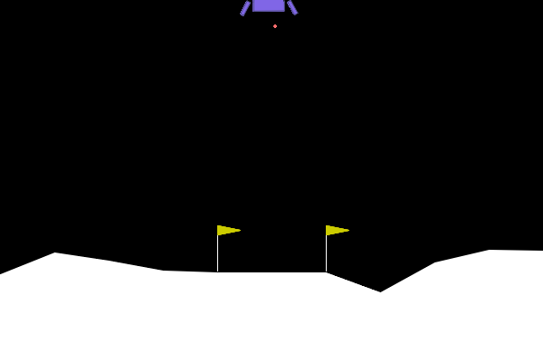
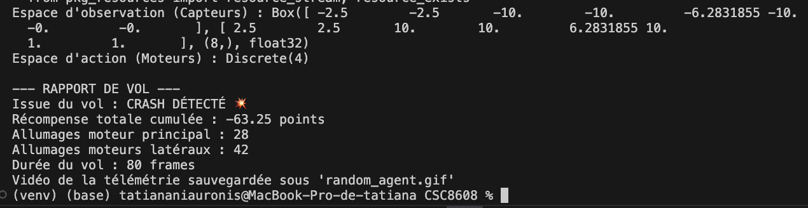
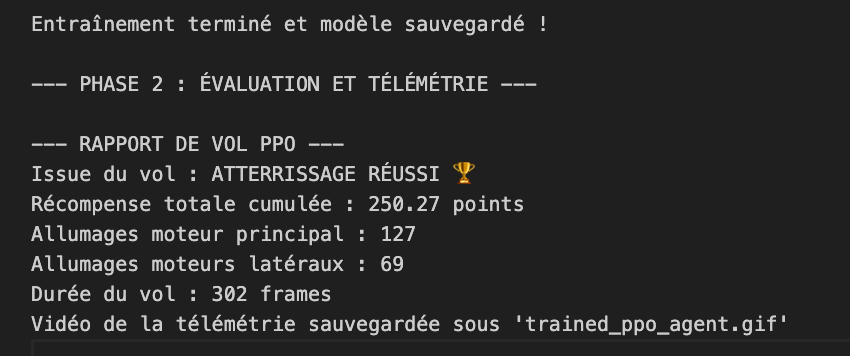
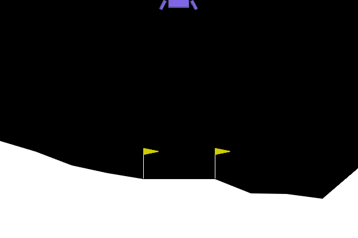
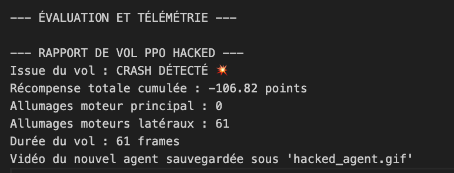
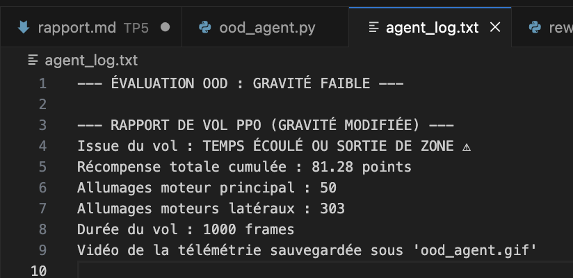
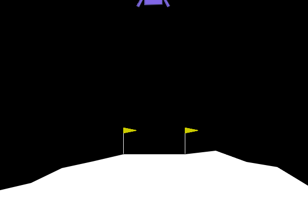

# **report.md — TP5 Deep Reinforcement Learning**
NIAURONIS Tatiana – FIPA 3A  
CSC8608 – TP5

---

## **Exercice 1 — Comprendre la Matrice et Instrumenter l'Environnement (Exploration de Gymnasium)**

### **Question 1.b**

Le GIF obtenu est:

Le raport de vol correspondant est:

Lors de ce test, l’agent aléatoire obtient une récompense totale de -63.25 points et est donc très loin du seuil de résolution de 200 points.  
Ce résultat est attendu car l’agent ne possède aucune stratégie et active les moteurs de manière totalement aléatoire ce qui conduit à un crash.

---

## **Exercice 2 — Entraînement et Évaluation de l'Agent PPO (Stable Baselines3)**

### **Question 2.b**

Le GIF obtenu est:

Le rapport de vol correspondant est:

Au début de l’entraînement, la récompense moyenne par épisode (`ep_rew_mean`) est fortement négative autour de -165 à -180.

Au fil des itérations, on observe une amélioration progressive et en fin d’entraînement, `ep_rew_mean` vaut 208, ce qui indique que l’agent a appris une politique efficace pour stabiliser et poser le module lunaire (NB: il reste de l'aléatoire).

---

## **Exercice 3 — L'Art du Reward Engineering (Wrappers et Hacking)**

### **Question 3.b**

Le GIF obtenu est:

Voici une copie du terminal:

L’agent apprend à ne jamais utiliser le moteur principal (0 allumage). Il n’utilise que les moteurs latéraux puis finit par s’écraser en 61 frames. Il accepte le crash plutôt que de consommer du carburant via le moteur principal.

Chaque activation du moteur principal inflige une pénalité de -50. Dès que l’agent utilise plusieurs fois le moteur principal, la somme des pénalités peut dépasser le bénéfice potentiel d’un atterrissage réussi. Il a supprimé totalement l’action 2 et d’accepter un crash.

---

## **Exercice 4 — Robustesse et Changement de Physique (Généralisation OOD)**

### **Question 4.b**

On obtient:

Le GIF est:

Sous gravité faible (-2.0), l’agent n’arrive pas à terminer la tâche qui se termine par timeout ou sortie de zone après 1000 frames. Le score reste positif mais faible (81.28) ce qui indique un comportement partiellement contrôlé mais pas une trajectoire d’atterrissage stable. On observe aussi une utilisation très élevée des moteurs latéraux (303 allumages).

---

## **Exercice 5 — Bilan Ingénieur : Le défi du Sim-to-Real**

### **Question 5.a**

L’expérience OOD a mis en évidence un problème fondamental en IA appliquée : le Sim-to-Real Gap. Notre agent PPO, performant en gravité standard (-10), échoue dès que la dynamique change (-2.0). 

Voici deux stratégies concrètes permettant d’améliorer la généralisation sans modifier l’algorithme PPO.

-  Au lieu d’entraîner l’agent avec une gravité fixe, on la fait varier aléatoirement à chaque épisode (gravité tirée aléatoirement dans un intervalle ([-12.0 ; -2.0]), vent aléatoire, variation de poussée moteur). L’agent apprend une stratégie robuste valable dans plusieurs environnements et pas seulement une situation ce qui réduit le risque d’échec.

- Actuellement, l'agent ne connaît pas explicitement la gravité. On pourrait ajouter la gravité (ou des paramètres dynamiques) comme nouvelle variable d’entrée. La politique deviendrait conditionnelle à ces paramètres physiques, ce qui permettrait à l’agent d’adapter son comportement selon l’environnement. On aurait moins d'overfitting et une meilleure adaptation.

