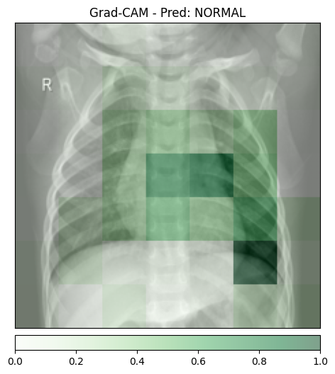
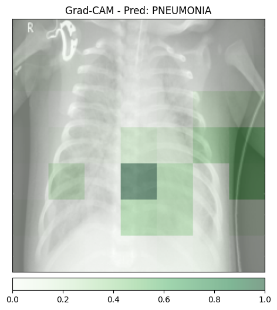
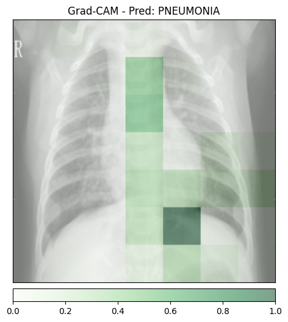
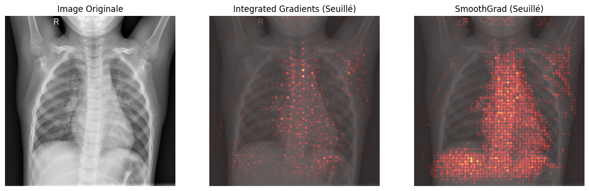
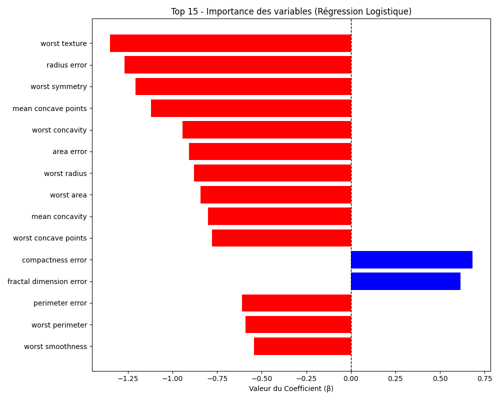
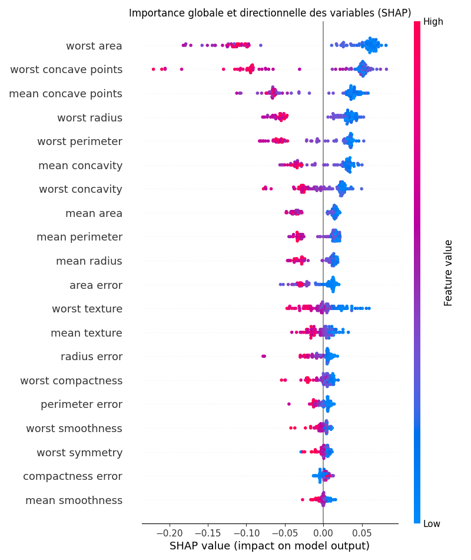

# **report.md — TP6 IA Explicable et Interprétable**
NIAURONIS Tatiana – FIPA 3A  
CSC8608 – TP6

---

## **Exercice 1 — Mise en place, Inférence et Grad-CAM**

### **Question 1.d**

Les 4 images générées sont:

- Radiographie normale (`normal_1.jpeg`)

- Radiographie normale (`normal_2.jpeg`)

- Pneumonie (`pneumo_1.jpeg`)

- Pneumonie (`pneumo_2.jpeg`)

## Analyse

Dans nos expérimentations, les deux images normales (`normal_1.jpeg` et `normal_2.jpeg`) ont été correctement classifiées comme NORMAL. Il n’y a donc pas eu de faux positif observé avec le modèle chargé (qui a changé).

On peut voir que les activations se situent majoritairement dans la zone thoracique et l'attention est concentrée dans la région centrale. Le modèle ne semble pas se focaliser sur des artefacts comme les bords de l’image ou des éléments hors du thorax.

Cela suggère que le modèle ne présente pas ici de biais de type Clever Hans.

## Granularité de l’explication

Les zones colorées apparaissent sous forme de gros blocs flous plutôt qu'au pixel près.

Cette perte de résolution s’explique par l’architecture du ResNet car au fil des couches convolutives, le réseau applique des convolutions avec stride, des opérations de pooling et des sous-échantillonnages successifs. Ces opérations réduisent la dimension spatiale de l’image et Grad-CAM calcule l’importance des activations sur la dernière carte de features compréssée.

---

## **Exercice 2 — Integrated Gradients et SmoothGrad**

### **Question 2.b**

L'image générée est:

Le temps de calcul pour Integrated Gradients est de 7.5127 secondes.  
Le temps de calcul pour SmoothGrad est de 1113.1833 secondes soit environ 18 minutes et 33 secondes. Au regard de cet écart avec une inférence classique (qui se fait en quelques millisecondes), il n’est pas technologiquement réaliste de générer SmoothGrad de manière synchrone au premier clic d’analyse d’un médecin. Une architecture adaptée consiste à retourner immédiatement le résultat d’inférence en synchrone, puis à déclencher la génération de l’explication en asynchrone via une file de messages (RabbitMQ) traitée par un worker GPU, avec mise à jour de l’interface dès que la heatmap est prête.

Concernant les couleurs bleu et rouge, pour une carte qui peut descendre sous zéro, le rouge correspond à des contributions positives qui augmentent le score de la classe, et le bleu à des contributions négatives qui le diminuent. L’avantage mathématique est de conserver les contributions positives et négatives alors que le ReLU de Grad-CAM supprime toutes les contributions négatives et ne montre que ce qui pousse la prédiction dans un seul sens.

---

## **Exercice 3 — Modélisation Intrinsèquement Interprétable (Glass-box) sur Données Tabulaires**

### **Question 3.c**

On obtient:

La variable qui pousse le plus fortement la prédiction vers la classe Maligne (classe 0) est worst texture car elle possède le coefficient négatif le plus important en valeur absolue.  

Les variables les plus influentes (plus grande valeur absolue du coefficient) sont worst texture, radius error et worst symmetry.

L’avantage d’un modèle glass-box comme la régression logistique est que l’explication est directement contenue dans les paramètres du modèle. Les coefficients indiquent l’impact de chaque variable sur la décision, sans avoir besoin d’une méthode post-hoc approximative comme Grad-CAM ou Integrated Gradients.

---

## **Exercice 4 — Explicabilité Post-Hoc avec SHAP sur un Modèle Complexe**

### **Question 4.c**

On obtient, avec une accuracy de 0.9649:

## Explicabilité globale

En observant le Summary Plot SHAP, les variables les plus importantes identifiées par le Random Forest sont notamment worst area, worst concave points, mean concave points, worst radius et worst perimeter. Dans l’exercice précédent avec la régression logistique, les variables les plus influentes incluaient worst texture, radius error et worst symmetry. On constate que plusieurs variables liées aux dimensions et à l’irrégularité de la tumeur apparaissent dans les deux modèles. Cela suggère que ces caractéristiques morphologiques constituent des biomarqueurs cliniques robustes car elles restent importantes indépendamment du type de modèle utilisé, qu’il soit linéaire ou non linéaire.

## Explicabilité locale

En analysant le Waterfall Plot du patient 0, la caractéristique qui contribue le plus à tirer la prédiction vers sa valeur finale est worst area, avec une valeur numérique de 677.9 pour ce patien avec une contribution de +0.07.

